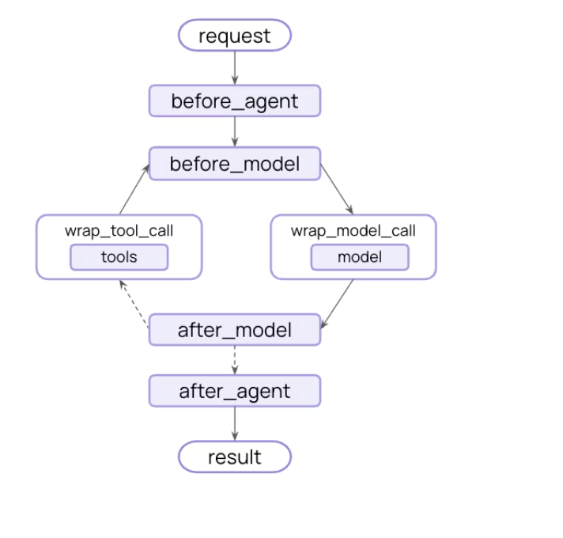

とりあえず
https://docs.langchain.com/oss/python/langchain/rag
の続きをやることにする。
tool callingを行うRAGともう一つ、dynamic_promptというのもあるらしい。

```python
from langchain.agents.middleware import dynamic_prompt, ModelRequest

@dynamic_prompt
def prompt_with_context(request: ModelRequest) -> str:
    """Inject context into state messages."""
    last_query = request.state["messages"][-1].text
    retrieved_docs = vector_store.similarity_search(last_query)

    docs_content = "\n\n".join(doc.page_content for doc in retrieved_docs)

    system_message = (
        "You are a helpful assistant. Use the following context in your response:"
        f"\n\n{docs_content}"
    )

    return system_message


agent = create_agent(model, tools=[], middleware=[prompt_with_context])
```

```bash
================================ Human Message =================================

What is task decomposition?
{'messages': [HumanMessage(content='What is task decomposition?', additional_kwargs={}, response_metadata={}, id='f08a2810-1e17-47a1-a959-507f23e12c7d'), AIMessage(content='Task decomposition is a project management technique that involves breaking down a complex task or project into smaller, more manageable sub-tasks. By dividing a task into smaller components, it becomes easier to assign responsibilities, track progress, and ensure that all necessary steps are completed successfully. Task decomposition helps team members focus on specific elements of a task, improves efficiency, and reduces the risk of overlooking important details. This approach can also help in estimating timelines, setting priorities, and allocating resources effectively.', additional_kwargs={'refusal': None}, response_metadata={'token_usage': {'completion_tokens': 95, 'prompt_tokens': 30, 'total_tokens': 125, 'completion_tokens_details': {'accepted_prediction_tokens': 0, 'audio_tokens': 0, 'reasoning_tokens': 0, 'rejected_prediction_tokens': 0}, 'prompt_tokens_details': {'audio_tokens': 0, 'cached_tokens': 0}}, 'model_provider': 'openai', 'model_name': 'gpt-3.5-turbo-0125', 'system_fingerprint': None, 'id': 'chatcmpl-DDpFnYspHmlCNzaONRlFEKgaaPf5n', 'service_tier': 'default', 'finish_reason': 'stop', 'logprobs': None}, id='lc_run--019c9e9d-9bbe-7ad3-b587-6b4f746f0db5-0', tool_calls=[], invalid_tool_calls=[], usage_metadata={'input_tokens': 30, 'output_tokens': 95, 'total_tokens': 125, 'input_token_details': {'audio': 0, 'cache_read': 0}, 'output_token_details': {'audio': 0, 'reasoning': 0}})]}
================================== Ai Message ==================================

Task decomposition is a project management technique that involves breaking down a complex task or project into smaller, more manageable sub-tasks. By dividing a task into smaller components, it becomes easier to assign responsibilities, track progress, and ensure that all necessary steps are completed successfully. Task decomposition helps team members focus on specific elements of a task, improves efficiency, and reduces the risk of overlooking important details. This approach can also help in estimating timelines, setting priorities, and allocating resources effectively.
```
単純にプロンプトを埋め込むミドルウェアを定義しているだけ。なんか便利そう。
その下に、AgentMiddleWareを利用したRaw Dataの保存スクリプトが書いてある。
使ってみたところ、
```python
取得ドキュメント数: 4

--- Document 1 ---
  metadata : {'source': 'https://lilianweng.github.io/posts/2023-06-23-agent/', 'start_index': 1638}
  content  : Component One: Planning#
A complicated task usually involves many steps. An agent needs to know what they are and plan ahead.
Task Decomposition#
Chain of thought (CoT; Wei et al. 2022) has become a s...

--- Document 2 ---
  metadata : {'source': 'https://lilianweng.github.io/posts/2023-06-23-agent/', 'start_index': 2578}
  content  : Task decomposition can be done (1) by LLM with simple prompting like "Steps for XYZ.\n1.", "What are the subgoals for achieving XYZ?", (2) by using task-specific instructions; e.g. "Write a story outl...

--- Document 3 ---
  metadata : {'source': 'https://lilianweng.github.io/posts/2023-06-23-agent/', 'start_index': 17734}
  content  : The AI assistant can parse user input to several tasks: [{"task": task, "id", task_id, "dep": dependency_task_ids, "args": {"text": text, "image": URL, "audio": URL, "video": URL}}]. The "dep" field d...

--- Document 4 ---
  metadata : {'source': 'https://lilianweng.github.io/posts/2023-06-23-agent/', 'start_index': 19303}
  content  : (3) Task execution: Expert models execute on the specific tasks and log results.
Instruction:

With the input and the inference results, the AI assistant needs to describe the process and results. The...
```
という感じでしっかりとメタデータの保存に成功している
dynamic_promptも
```python
@overload
def dynamic_prompt(
    func: _CallableReturningSystemMessage[StateT, ContextT],
) -> AgentMiddleware[StateT, ContextT]: ...
```
という仕様になっているので、結局のところAgentMiddleWareクラスを使うとlangchainのミドルウェアをいじれそう

```python
 middleware: A sequence of middleware instances to apply to the agent.

            Middleware can intercept and modify agent behavior at various stages.

            !!! tip ""

                See the [Middleware](https://docs.langchain.com/oss/python/langchain/middleware)
                docs for more information.
```
https://docs.langchain.com/oss/python/langchain/middleware/overview
に色々な詳細あり

こんな感じで、toolやresultを呼び出す前後に関数をかますことができるらしい。
https://docs.langchain.com/oss/python/langchain/middleware/built-in

この辺にいっぱいあるな
AntigravityだとかCodexのtool call時の承認機能とかはHumanIntheLoopとかを使えば利用できるわけだね
個人情報の検出とかもあるし、サブエージェントの追加もできる。

Streamは一旦置いておいて、Short-term memoryをやってみたい
```python
from langchain.agents import create_agent, AgentState
from langgraph.checkpoint.memory import InMemorySaver


class CustomAgentState(AgentState):  
    user_id: str
    preferences: dict

agent = create_agent(
    "gpt-5",
    tools=[get_user_info],
    state_schema=CustomAgentState,  
    checkpointer=InMemorySaver(),
)

# Custom state can be passed in invoke
result = agent.invoke(
    {
        "messages": [{"role": "user", "content": "Hello"}],
        "user_id": "user_123",  
        "preferences": {"theme": "dark"}  
    },
    {"configurable": {"thread_id": "1"}})
```

短期記憶を入れると、コンテキストウインドウがデカくなりすぎるので、色々対策する
```python
@before_model
def trim_messages(state: AgentState, runtime: Runtime) -> dict[str, Any] | None:
    """Keep only the last few messages to fit context window."""
    messages = state["messages"]

    if len(messages) <= 3:
        return None  # No changes needed

    first_msg = messages[1]
    recent_messages = messages[-3:] if len(messages) % 2 == 0 else messages[-4:]
    new_messages = [first_msg] + recent_messages

    return {
        "messages": [
            RemoveMessage(id=REMOVE_ALL_MESSAGES),
            *new_messages
        ]
    }
```
これのbefore_modelっていうのは、ミドルウェアの図のやつのことだと思う
```bash
I don’t know your name—you haven’t told me yet. What would you like me to call you?
```
ちょっと中身をいじってみたら、教えたはずの名前を忘れたので、うまく行ってそう。今まで直接注入していたが、これを使った方が綺麗に色々管理できる
ところで、`InMemorySaver`が何をしているかよくわかんない
