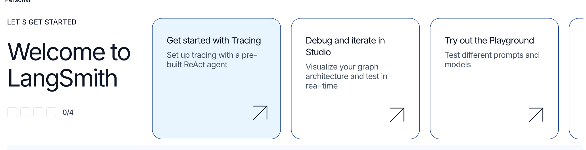

セマンティック検索にLangSmithを使おうとしているようなので、ちょっと環境整備

https://docs.langchain.com/oss/python/langchain/knowledge-base

```python
from langchain_core.documents import Document

documents = [
    Document(
        page_content="Dogs are great companions, known for their loyalty and friendliness.",
        metadata={"source": "mammal-pets-doc"},
    ),
    Document(
        page_content="Cats are independent pets that often enjoy their own space.",
        metadata={"source": "mammal-pets-doc"},
    ),
]
```
page_content: コンテンツを表す文字列。
metadata: 任意のメタデータを含む辞書。
id: (オプション) ドキュメントの文字列識別子。

という要素をドキュメントが持っている。「個々のドキュメントは、多くの場合より大きいドキュメントの一部だそうなので、Chunkに近いのかな...？

なんか見た感じPyPDFLoaderの返り値の定義がこれらしい。

そこから下の話は割と知っているのでスキップ！

Retrieverというものが紹介された。

```python
from typing import List

from langchain_core.documents import Document
from langchain_core.runnables import chain


@chain
def retriever(query: str) -> List[Document]:
    return vector_store.similarity_search(query, k=1)


retriever.batch(
    [
        "How many distribution centers does Nike have in the US?",
        "When was Nike incorporated?",
    ],
)
```
VectorStoreがRunnableを継承しないとかなんとか言っている。

Runnable:呼び出し、バッチ処理、ストリーミング、変換、および合成が可能な作業単位のことらしい。
```python
from langchain_core.runnables import RunnableLambda

# A RunnableSequence constructed using the `|` operator
sequence = RunnableLambda(lambda x: x + 1) | RunnableLambda(lambda x: x * 2)
sequence.invoke(1)  # 4
sequence.batch([1, 2, 3])  # [4, 6, 8]

# A sequence that contains a RunnableParallel constructed using a dict literal
sequence = RunnableLambda(lambda x: x + 1) | {
    "mul_2": RunnableLambda(lambda x: x * 2),
    "mul_5": RunnableLambda(lambda x: x * 5),
}
print(sequence.invoke(1)) # {'mul_2': 4, 'mul_5': 10}
```

ラムダ式みたいなもんかな..
で、RetrieverはRunnableを継承しているので、VectorStoreを`as_retriever`メソッドで
`VectorStoreRetriever`に変えてあげるのだという話をしている。

まあtoolsとかにするにはRunnable出ないと使えないよーということなのかな。


RAGアプリケーションの評価手法について学んでみる。

https://docs.langchain.com/langsmith/evaluate-rag-tutorial

```python
from langchain_community.document_loaders import WebBaseLoader
from langchain_core.vectorstores import InMemoryVectorStore
from langchain_openai import OpenAIEmbeddings
from langchain_text_splitters import RecursiveCharacterTextSplitter

# List of URLs to load documents from
urls = [
    "https://lilianweng.github.io/posts/2023-06-23-agent/",
    "https://lilianweng.github.io/posts/2023-03-15-prompt-engineering/",
    "https://lilianweng.github.io/posts/2023-10-25-adv-attack-llm/",
]

# Load documents from the URLs
docs = [WebBaseLoader(url).load() for url in urls]
docs_list = [item for sublist in docs for item in sublist]

# Initialize a text splitter with specified chunk size and overlap
text_splitter = RecursiveCharacterTextSplitter.from_tiktoken_encoder(
    chunk_size=250, chunk_overlap=0
)

# Split the documents into chunks
doc_splits = text_splitter.split_documents(docs_list)

# Add the document chunks to the "vector store" using OpenAIEmbeddings
vectorstore = InMemoryVectorStore.from_documents(
    documents=doc_splits,
    embedding=OpenAIEmbeddings(),
)

# With langchain we can easily turn any vector store into a retrieval component:
retriever = vectorstore.as_retriever(k=6)
```
これくらいのコードなら慣れたもので、
WebBaseLoaderでurlからlist[Document]を取得し、一次元展開。

段落や改行をもとにチャンキングして、OpenAIEmbeddingでベクトライズ。コサイン類似度で上位6つのチャンクを取得してくるというRAGシステム。

```python
from langchain_openai import ChatOpenAI
from langsmith import traceable

llm = ChatOpenAI(model="gpt-4.1", temperature=1)

# Add decorator so this function is traced in LangSmith
@traceable()
def rag_bot(question: str) -> dict:
    # LangChain retriever will be automatically traced
    docs = retriever.invoke(question)
    docs_string = "".join(doc.page_content for doc in docs)
    instructions = f"""You are a helpful assistant who is good at analyzing source information and answering questions.
       Use the following source documents to answer the user's questions.
       If you don't know the answer, just say that you don't know.
       Use three sentences maximum and keep the answer concise.

Documents:
{docs_string}"""
    # langchain ChatModel will be automatically traced
    ai_msg = llm.invoke([
            {"role": "system", "content": instructions},
            {"role": "user", "content": question},
        ],
    )
    return {"answer": ai_msg.content, "documents": docs}
```
どうも改行の仕方が大変気持ち悪いが、単純にdocstringを作成して、RAG検索、取得したドキュメントを埋め込みしてllm_invokeしている。
よく見たらこの辺も`invoke`によって呼び出しが始まっているので、`Runnable`オブジェクトを作成するという話とつながっている。

ところで`traceable`デコレータとかいうのが新しく登場した。
